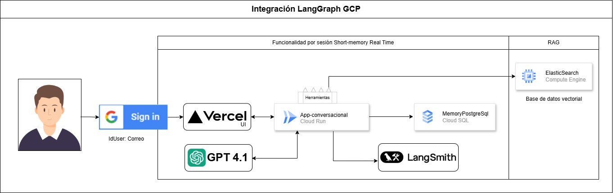

# Taller URP – Aplicación GenAI *end‑to‑end*

**Construye un asistente conversacional** que combina:

- **LangChain** para orquestar la lógica de IA  
- **RAG** (Retrieve‑Augment‑Generate) sobre **Elasticsearch 8.x**  
- **Memoria de corto plazo** con **Cloud SQL (PostgreSQL)** y checkpoints  
- **Trazabilidad** completa vía **LangSmith**  
- Despliegue **Docker → Cloud Run (GCP)** y **UI React / Next.js en Vercel**

> Este repositorio acompaña el taller dictado en la Universidad Ricardo Palma.  
> El flujo completo explicado en almenos 2 horas, desde el notebook hasta producción.

Taller completo: 

---

## ⬇️ Contenido del repositorio

| Ruta | Descripción |
|------|-------------|
| `Taller_URP_APP_DATA.ipynb` | Notebook Colab con todo el paso a paso para construir el agente. |
| `Taller_URP_APP_DATA_CARGA.ipynb` | Notebook Colab opcional: Carga datos de prueba en base de datos vectorial Elasticsearch. |
| `data.csv` | Notebook Colab opcional: Datos de prueba para la base de datos vectorial. |
| `Taller GenAI Crea tu primera aplicación.pdf` | Presentación del taller (16 slides). |
| `docs/` | Carpeta de arquitectura  |
| &nbsp;&nbsp;└ `arquitectura_overview.jpg` | Arquitectura de la solucion. |
| `CloudRun/` | Carpeta con el microservicio listo para Docker ➜ Cloud Run |
| &nbsp;&nbsp;└ `app.py` | Código Python del agente (API `/agent`). |
| &nbsp;&nbsp;└ `Dockerfile` | Imagen multistage ligera. |
| &nbsp;&nbsp;└ `requirements.txt` | Dependencias congeladas. |

Plantillas FrontEnd (repos externos):

- Login con Google → <https://github.com/macespinoza/agentui-withlogin>  
- Sin login → <https://github.com/macespinoza/agentui-withoutlogin>

---

## 🗺️ Arquitectura

1. **Usuario** interactúa desde el navegador (Vercel).  
2. **Cloud Run** recibe `/agent?msg=...&idagente=...` y activa LangChain.  
3. El **agente** consulta → Elasticsearch (conocimiento) + PostgreSQL (memoria).  
4. GPT‑4.1 genera la respuesta; LangSmith traza cada paso.  
5. La respuesta JSON vuelve a la UI en tiempo real.

